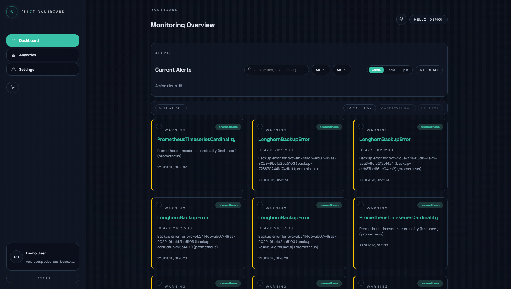

<div align="center" width="100%">
  
</div>

# PulZe Dashboard

PulZe is a self-hosted monitoring dashboard that aggregates alerts from Prometheus/Alertmanager, Zabbix, and Uptime Kuma in one place.




## Features

- Unified alert view (cards, table, split)
- Cross-source filtering and search
- Bulk acknowledge/resolve with audit trail
- Role-based access control
- SAML SSO support (provider-agnostic)
- Appearance and branding customization
- Analytics and trend views

## Run with Docker Compose

Image:
- `aleksanderurbaniak/pulze-dashboard:latest`

`compose.yml` already includes:
- `APP_VERSION`
- `APP_BASE_URL` (important for SAML behind domain/reverse proxy)

Example `.env`:

```env
APP_VERSION=v1.0.0
APP_BASE_URL=https://pulze-demo.auware.xyz
```

Start:

```bash
docker compose pull
docker compose up -d
```

PulZe is available on `http://localhost:3000` (or your configured domain).

Stop:

```bash
docker compose down
```

## Run from Local Source

Requirements:
- Node.js 20+
- npm

```bash
npm install
npm run dev
```

Production build:

```bash
npm run build
npm start
```

## SAML Setup

PulZe uses SAML (OIDC is not used in the current flow).

In your IdP (Authentik, Keycloak, Okta, Entra ID, OneLogin, etc.):

1. Create a SAML application/provider.
2. Set ACS URL to:
   - `https://your-domain/api/auth/sso/saml/callback`
3. Set Audience / SP Entity ID to the same value you configure in PulZe `SP entity ID`.
4. Configure claims/attributes so a username attribute is sent.

In PulZe (`Settings -> Access -> SAML Provider`), fill:
- `IdP entity ID`
- `SSO service URL`
- `SLO service URL` (optional)
- `Username attribute`
- `SP entity ID`
- `SP name ID format`

Notes:
- `APP_BASE_URL` must match the public URL used by users and IdP.
- If your IdP does not expose signing certs in metadata, signature validation may fail until signing is configured.

## Versioning

- App version is resolved from latest local Git tag (`git describe --tags --abbrev=0`)
- Fallback is `package.json` version (`v1.0.0`)
- Check resolved version:

```bash
npm run version:repo
```

## Data Sources

Multiple instances are supported for each source:

- Prometheus/Alertmanager: base URL; `/api/v2/alerts` is appended
- Zabbix: base URL; `/zabbix/api_jsonrpc.php` is appended
- Uptime Kuma: base URL + mode (`status` or `apiKey`)

## Data Persistence

- Local: SQLite file at `data/pulze.db`
- Docker: named volume `pulze-data` mounted to `/app/data`

## Troubleshooting

- If `better-sqlite3` fails on Windows, use Node.js LTS and install Visual Studio Build Tools.
- If SAML ACS mismatch appears, set `APP_BASE_URL` to the exact public URL.
