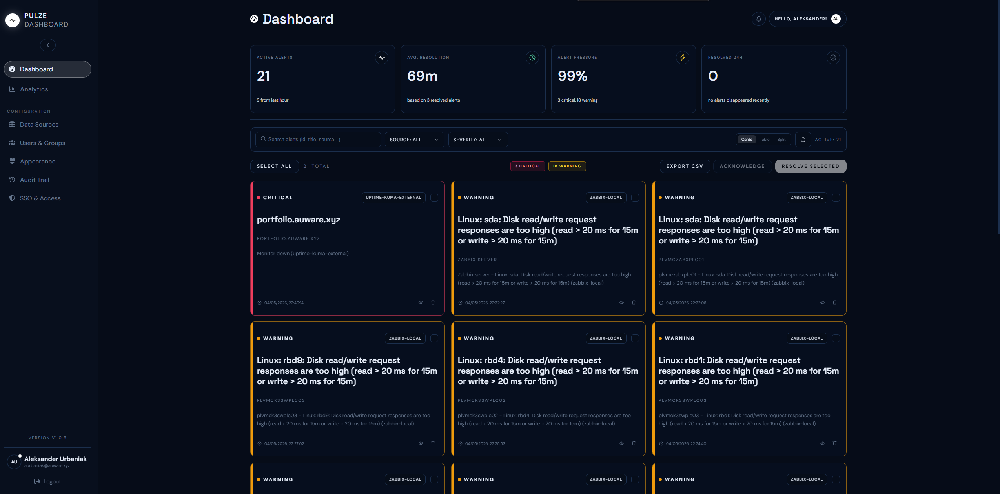

# PulZe Dashboard

> [!WARNING]
> PulZe Dashboard is **vibecoded** software. It is built with care, but it has not been battle-tested like a commercial monitoring control plane. Review the code, keep backups, and **use it at your own risk**.

<p align="center">
  
  
  
  
  
</p>

<p align="center">
  <strong>A self-hosted monitoring dashboard for Prometheus/Alertmanager, Zabbix, and Uptime Kuma.</strong>
</p>

<p align="center">
  Bring alerts, incident state, source health, access control, analytics, and audit activity into one clean web UI.
</p>

<p align="center">
  
</p>

---

## What It Does

PulZe Dashboard is a lightweight control room for teams that need one place to inspect alert noise across several monitoring systems. It pulls alerts from Prometheus Alertmanager, Zabbix, and Uptime Kuma, then lets operators filter, search, acknowledge, resolve, and review activity without jumping between tools.

It is especially useful when you want a self-hosted status desk with role-based access, SAML login, saved dashboard views, appearance customization, and a persistent audit trail.

## Highlights

| Area | What PulZe gives you |
| --- | --- |
| **Unified alerts** | Browse Prometheus/Alertmanager, Zabbix, and Uptime Kuma alerts together. |
| **Dashboard views** | Switch between cards, table, and split views for different operating styles. |
| **Filtering** | Search and filter across source, severity, status, environment, team, and labels. |
| **Bulk actions** | Acknowledge and resolve multiple alerts with recorded state changes. |
| **Analytics** | Review alert trends, summary metrics, and team snapshots. |
| **Access control** | Use roles for admins, operators, viewers, and auditors. |
| **Authentication** | Local accounts, optional 2FA, and SAML SSO for an IdP-backed flow. |
| **Customization** | Tune branding, theme, accent color, and visual effects from settings. |
| **Self-hosting** | Run it with Docker Compose or develop locally with Node.js and SQLite. |

## App Sections

- **Dashboard** - live alert overview, filters, saved views, source refresh, and bulk state actions.
- **Analytics** - alert summaries, trends, response signals, and team-oriented snapshots.
- **Settings** - data sources, users, roles, audit log, SAML provider settings, and appearance controls.
- **Profile** - account details, password changes, and two-factor authentication setup.

## Quick Start With Docker

1. Copy the example environment file:

```bash
cp .env.example .env
```

2. Set the public base URL:

```bash
APP_BASE_URL=https://pulze.example.com
```

3. Start the app:

```bash
docker compose pull
docker compose up -d
```

PulZe Dashboard will be available at:

```text
http://localhost:3000
```

The Docker Compose setup stores SQLite data in the `pulze-data` volume and mounts it at `/app/data`.

## Local Development

Requirements:

- Node.js 20+
- npm

Run:

```bash
npm install
cp .env.example .env
npm run dev
```

Then open:

```text
http://localhost:3000
```

## Environment

```bash
APP_BASE_URL=https://pulze.example.com
SAML_ALLOW_UNSIGNED=false
```

`APP_BASE_URL` is used to build SAML callback and redirect URLs. It must match the public URL used by your users and identity provider.

## Data Source Notes

PulZe supports multiple instances for each source type:

- **Prometheus/Alertmanager** - provide the base URL; PulZe appends `/api/v2/alerts`.
- **Zabbix** - provide the base URL; PulZe appends `/zabbix/api_jsonrpc.php`.
- **Uptime Kuma** - provide a base URL and choose status page or API key mode.

After adding a source, use the built-in source test action to confirm the endpoint and credentials.

## SAML Notes

PulZe uses SAML for SSO in the current auth flow.

In your IdP, such as Authentik, Keycloak, Okta, Entra ID, or OneLogin:

1. Create a SAML application or provider.
2. Set the ACS URL to:

```text
https://your-domain/api/auth/sso/saml/callback
```

3. Set the Audience / SP Entity ID to the same value configured in PulZe.
4. Send a stable username attribute.

In PulZe, open **Settings -> Access -> SAML Provider** and configure the IdP entity ID, SSO service URL, optional SLO service URL, username attribute, SP entity ID, and SP name ID format.

## Security Notes

PulZe includes several safety-minded features:

- Password-based login with server-side sessions
- Optional two-factor authentication
- SAML SSO configuration
- Role-based permissions
- Audit events for important actions
- Runtime image hardening for the Docker build

This does not make it a hardened enterprise product. Put it behind HTTPS, restrict network access where possible, protect the SQLite volume, keep the container updated, and review changes before trusting it with important monitoring workflows.

## Useful Scripts

```bash
npm run dev            # Start the Next.js dev server
npm run build          # Build the production app
npm run start          # Start a built Next.js app
npm run lint           # Run ESLint
npm run version:repo   # Resolve the app version from Git/package metadata
npm run docker:build   # Build a versioned Docker image
npm run docker:up      # Start the versioned Docker Compose stack
npm run docker:up:fg   # Start Docker Compose in the foreground
npm run docker:down    # Stop the Docker Compose stack
```

## Versioning

- Release source of truth: **Git tags**
- Tag format: `vMAJOR.MINOR.PATCH` such as `v1.0.0`
- Runtime version source:
  - CI and Docker builds use the injected `APP_VERSION`
  - Local builds fall back to the latest local Git tag
  - Non-tagged environments fall back to `package.json`

Helpful version command:

```bash
npm run version:repo
```
